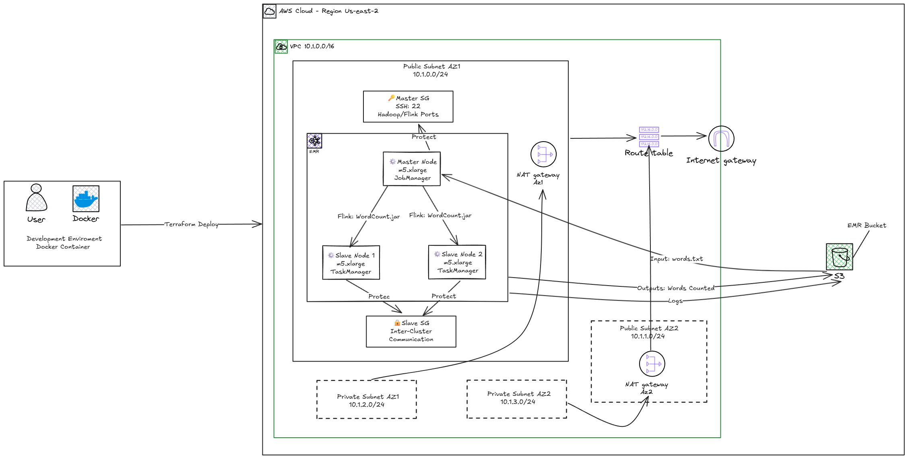

# 🚀 AWS EMR com Apache Flink - Infraestrutura como Código

> **Demonstração prática de Big Data Processing usando Amazon EMR, Apache Flink e Terraform**

Este projeto demonstra como provisionar e configurar uma infraestrutura completa na AWS para processamento de dados usando **Amazon EMR** com **Apache Flink**, tudo gerenciado através de **Terraform** (Infraestrutura como Código). O projeto executa um exemplo prático de contagem de palavras processando arquivos de texto armazenados em S3.

## 🎯 Objetivo

Implementar uma solução de processamento de Big Data usando:
- **Amazon EMR** como plataforma de cluster gerenciado
- **Apache Flink** como engine de processamento de stream/batch
- **Terraform** para automação de infraestrutura 
- **Docker** para ambiente de desenvolvimento isolado
- **S3** para armazenamento de dados de entrada e saída

## 🏗️ Arquitetura da Solução



## 📁 Estrutura do Projeto

```
di-aws-emr-with-apache-flink/
├── 📄 README.md                           # Documentação do projeto
├── 🐳 dockerfile                          # Imagem Docker com Terraform e AWS CLI
├── 🐳 docker-compose.yaml                 # Orquestração do ambiente
├── 📝 LICENSE                             # Licença MIT
└── 🗂️ terraform/                          # Código Terraform
    ├── 📋 main.tf                         # Configuração principal
    ├── 📋 variables.tf                    # Definição de variáveis
    ├── 📋 terraform.tfvars                # Valores das variáveis
    ├── 📋 outputs.tf                      # Outputs da infraestrutura
    ├── 📋 providers.tf                    # Providers AWS
    ├── 📋 .terraform.lock.hcl             # Lock de versões
    └── 🗂️ modules/                        # Módulos reutilizáveis
        ├── 🗂️ vpc/                        # Módulo de rede
        │   ├── 📋 main.tf
        │   ├── 📋 outputs.tf
        │   └── 📋 variables.tf
        ├── 🗂️ emr/                        # Módulo EMR
        │   ├── 📋 main.tf                 # Cluster EMR + Steps
        │   ├── 📋 iam.tf                  # Roles e políticas IAM
        │   ├── 📋 security_group.tf       # Security Groups
        │   ├── 📋 ssh.tf                  # Chaves SSH
        │   ├── 📋 variables.tf
        │   ├── 📋 outputs.tf
        │   └── 🗂️ keys/                   # Chaves SSH geradas
        └── 🗂️ emr_bucket/                 # Módulo S3
            ├── 📋 main.tf                 # Bucket S3 e objetos
            ├── 📋 outputs.tf
            ├── 📋 variables.tf
            └── 🗂️ data/
                └── 🗂️ inputs/
                    └── 📄 words.txt       # Arquivo de teste
```

## 🛠️ Pré-requisitos

### 🔑 Credenciais AWS
Criar um arquivo `.env` na raiz do projeto com suas credenciais AWS:

```bash
# AWS credentials for CLI in container  
AWS_ACCESS_KEY_ID=sua_access_key_aqui
AWS_SECRET_ACCESS_KEY=sua_secret_key_aqui
AWS_DEFAULT_REGION=us-east-2
```

### 📋 Ferramentas Necessárias
- **Docker** e **Docker Compose**
- **Conta AWS** com permissões para criar recursos EMR, EC2, VPC, S3, IAM
- **Terraform** (incluído no container Docker)

## 🚀 Como Executar

### 1️⃣ Clonar o Repositório
```bash
git clone https://github.com/JadesonBruno/di-aws-emr-with-apache-flink.git
cd di-aws-emr-with-apache-flink
```

### 2️⃣ Configurar Credenciais
```bash
# Criar arquivo .env com suas credenciais AWS
cp .env.example .env
# Editar .env com suas credenciais
```

### 3️⃣ Subir o Ambiente Docker
```bash
docker-compose up -d --build
```

### 4️⃣ Acessar o Container
```bash
docker-compose exec terraform /bin/bash
```

### 5️⃣ Executar Terraform
```bash
# Inicializar Terraform
terraform init

# Revisar o plano de execução
terraform plan

# Aplicar a infraestrutura
terraform apply
```

### 6️⃣ Acompanhar a Execução
- **Console AWS EMR**: Monitore o cluster e jobs
- **CloudWatch**: Visualize logs e métricas
- **S3**: Verifique arquivos de entrada e saída

### 7️⃣ Limpeza (Destruir Recursos)
```bash
terraform destroy
```

## ⚙️ Configurações Principais

### 🔧 Variáveis Terraform (terraform.tfvars)
```hcl
# Configurações globais
project_name = "emr-with-apache-flink"
environment  = "dev"
aws_region   = "us-east-2"

# Configurações de rede
vpc_cidr_block = "10.1.0.0/16"

# Configurações EMR
emr_release_label = "emr-7.10.0"
emr_applications  = ["flink", "hadoop", "hive", "zeppelin"]
main_instance_type  = "m5.xlarge"
main_instance_count = 1
core_instance_type  = "m5.xlarge" 
core_instance_count = 2
core_instance_ebs_size = 80
allowed_cidrs = ["seu_ip_publico/32"]
```

### 🎯 Configurações do Flink
```json
{
  "Classification": "flink-conf",
  "Properties": {
    "parallelism.default": "2",
    "taskmanager.numberOfTaskSlots": "2", 
    "taskmanager.memory.process.size": "2G",
    "jobmanager.memory.process.size": "1G",
    "execution.checkpointing.interval": "180000",
    "execution.checkpointing.mode": "EXACTLY_ONCE"
  }
}
```

## 🔍 Como Funciona

1. **📤 Upload de Dados**: O arquivo `words.txt` é automaticamente enviado para S3 via Terraform
2. **🚀 Cluster EMR**: Um cluster é criado com 1 master + 2 core nodes executando Flink
3. **⚡ Job Flink**: Um step EMR executa o exemplo WordCount:
   ```bash
   flink run -m yarn-cluster /usr/lib/flink/examples/streaming/WordCount.jar \
     --input s3a://bucket/data/inputs/words.txt \
     --output s3a://bucket/data/outputs/wordcount/
   ```
4. **📊 Resultados**: A contagem de palavras é salva em S3 na pasta `outputs/`
5. **📈 Monitoramento**: Logs e métricas são enviados para CloudWatch

## 🔐 Segurança Implementada

- **🛡️ Security Groups**: Acesso restrito por IP e portas específicas
- **🔑 IAM Roles**: Princípio do menor privilégio
- **🔒 Chaves SSH**: Geradas automaticamente pelo Terraform
- **🌐 VPC**: Isolamento de rede com subnets públicas/privadas
- **📝 CloudTrail**: Auditoria de ações (configurável)

## 💰 Estimativa de Custos

**Recursos principais** (região us-east-2):
- **EMR**: ~$0,27/hora (1 m5.xlarge master + 2 m5.xlarge core)
- **EC2**: Incluído no custo EMR
- **S3**: ~$0,023/GB armazenado
- **CloudWatch**: ~$0,50/GB logs ingeridos

**Total estimado**: ~$6,50/dia (24h contínuas)

⚠️ **Importante**: Execute `terraform destroy` após os testes para evitar custos desnecessários.

## 🐛 Troubleshooting

### ❌ Erro de Dependências Security Groups
```bash
# Problema: DependencyViolation ao destruir SGs
# Solução: Destruir EMR primeiro
terraform destroy -target=module.emr.aws_emr_cluster.emr_cluster
terraform apply
```

### ❌ Acesso Negado S3
```bash
# Verificar se o EMR service role tem permissões S3
aws iam list-attached-role-policies --role-name EMR_DefaultRole
```

### ❌ Falha de Conectividade
```bash
# Verificar security groups e regras
aws ec2 describe-security-groups --group-ids sg-xxxxxxxxx
```

## 📚 Recursos e Referências

- [📖 Amazon EMR Documentation](https://docs.aws.amazon.com/emr/)
- [⚡ Apache Flink Documentation](https://flink.apache.org/docs/)
- [🏗️ Terraform AWS Provider](https://registry.terraform.io/providers/hashicorp/aws/)
- [🐳 Docker Documentation](https://docs.docker.com/)
- [☁️ AWS Well-Architected Framework](https://aws.amazon.com/architecture/well-architected/)

## 🔄 Próximos Passos e Melhorias

- [ ] **🔄 CI/CD Pipeline**: Implementar GitHub Actions
- [ ] **📊 Dashboard Grafana**: Visualização avançada de métricas
- [ ] **🔒 Vault Integration**: Gerenciamento seguro de secrets
- [ ] **🎯 Auto Scaling**: Ajuste automático do cluster baseado em carga
- [ ] **🌍 Multi-Region**: Deploy em múltiplas regiões AWS
- [ ] **📦 Terraform Modules Registry**: Publicar módulos reutilizáveis
- [ ] **🧪 Testes**: Terratest para validação de infraestrutura
- [ ] **📈 Alertas**: Configuração de alertas CloudWatch/SNS

## 📞 Suporte e Contato

**Jadeson Bruno**
- Email: jadesonbruno.a@outlook.com
- GitHub: [@JadesonBruno](https://github.com/JadesonBruno)
- LinkedIn: [Jadeson Bruno](https://www.linkedin.com/in/jadeson-silva/)

---

⭐ **Se este projeto foi útil, deixe uma estrela no repositório!**

📝 **Licença**: MIT - veja o arquivo [LICENSE](LICENSE) para detalhes.
